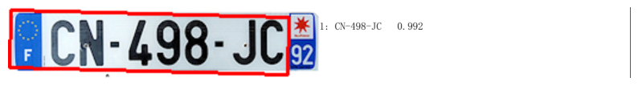
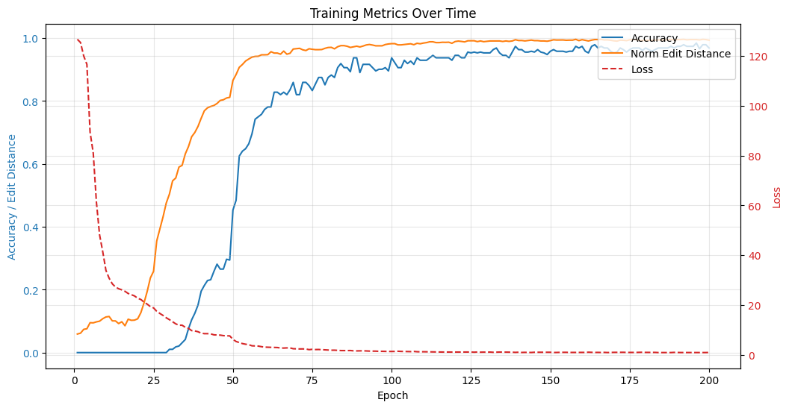
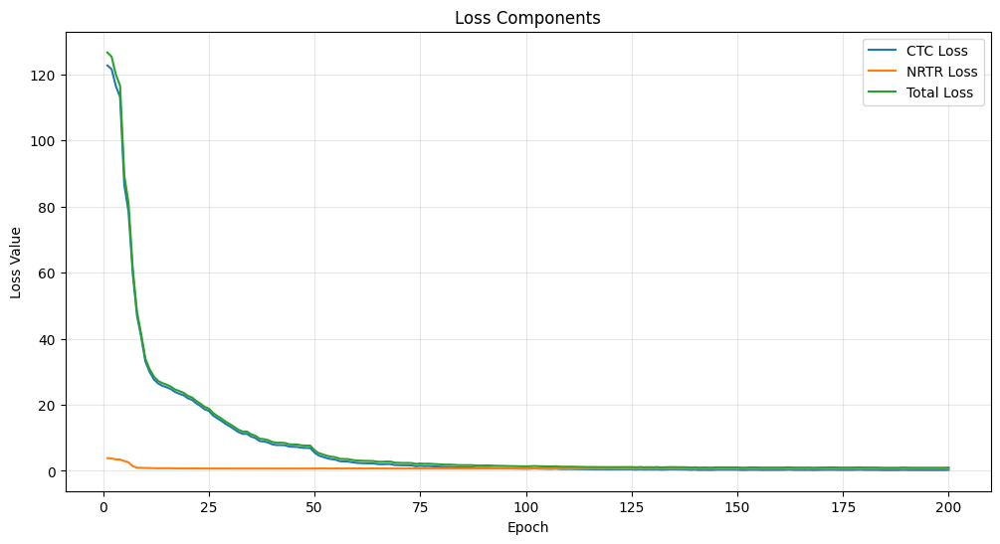
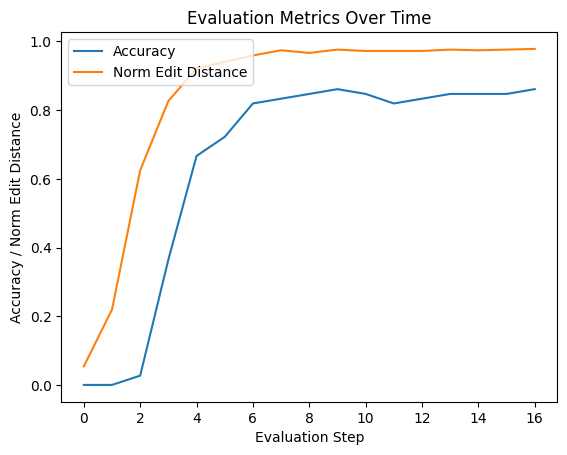
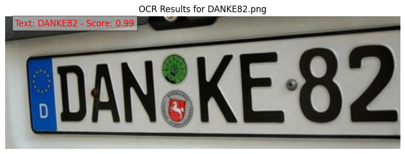
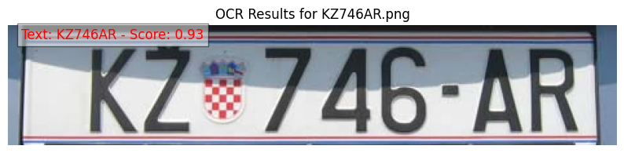
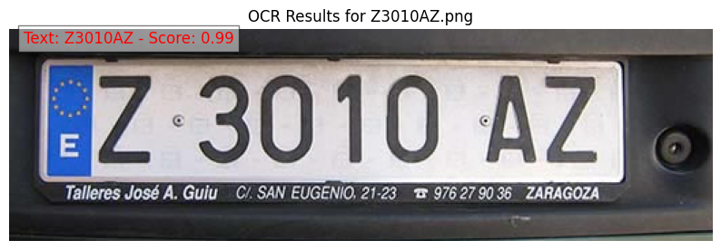

# License Plate OCR with PaddleOCR

This project is aimed at developing an OCR model to recognize license plates using PaddleOCR. The project leverages PaddlePaddle's powerful deep learning library for optical character recognition.

## Project Overview

In this project, a custom OCR model is trained to recognize license plates using the PaddleOCR framework. The following scripts and files are used to prepare data, configure the model, and train it effectively.

### Files Included
- **License_plate_with_paddle_OCR.ipynb**: Jupyter notebook for setting up the environment, data, and running the training and evaluation.
- **create_config.py**: Python script to generate the model configuration file (`config.yml`).
- **create_dict_file.py**: Script to create a dictionary file for the OCR model.
- **create_training_list.py**: Script to create the list of training images.
- **paddleocr_training/config.yml**: Configuration file for the PaddleOCR training.
- **paddleocr_training/dict.txt**: A dictionary of characters to train the OCR model.
- **paddleocr_training/test_list.txt**: List of testing images for the OCR model.
- **paddleocr_training/train_list.txt**: List of training images for the OCR model.
- **paddleocr_training/val_list.txt**: List of validation images for the OCR model.
- **prepare_traning.py**: Script to prepare the data and environment for training.

## Data Overview

The training and testing datasets consist of images containing license plates. The data is organized into training, validation, and test sets, with corresponding labels. You can modify the `train_list.txt`, `val_list.txt`, and `test_list.txt` files to suit your dataset.

### Installation

To set up the environment, run the following commands:

1. Clone the PaddleOCR repository:
   ```bash
   git clone https://github.com/PaddlePaddle/PaddleOCR.git
   ```
2. Install the required dependencies:
    ```bash
    pip install -r PaddleOCR/requirements.txt
    pip install paddlepaddle-gpu paddleocr pillow tqdm
    ```
### Usage
Once the environment is set up, you can proceed with training the model:

1. Train the OCR model:
    ```bash
    python PaddleOCR/tools/train.py -c paddleocr_training/config.yml
    ```
2. Evalue the OCR model:
    ```bash
    python3 -m paddle.distributed.launch --gpus '0' tools/eval.py -c paddleocr_training/config.yml -o Global.checkpoints=/output/rec_ppocr_v4/best_accuracy
    ```
3. Export the trained model:
    ```bash
    python3 PaddleOCR/tools/export_model.py -c paddleocr_training/config.yml -o Global.pretrained_model=/output/rec_ppocr_v4/best_accuracy  Global.save_inference_dir=/output/inference/license_plate_model
    ```

# Model Export
The model will be exported to the specified directory (/output/inference/license_plate_model). You can use this exported model for inference on new license plate images.

```bash
!python3 PaddleOCR/tools/export_model.py -c paddleocr_training/config.yml -o Global.pretrained_model=/output/rec_ppocr_v4/best_accuracy  Global.save_inference_dir=/output/inference/license_plate_mode
```
## Inference Image
After exporting the model to an inference model we can use package PaddleOCR for inference

```bash
# Path to the image
img_path = 'CN498JC.png'

# Initialize the OCR model
ocr = PaddleOCR(use_angle_cls=True, use_gpu=True, rec_model_dir="/output/inference/license_plate_mode/inference")

# Perform OCR
result = ocr.ocr(img_path, det=True, rec=True, cls=False)[0]

# Visualize the result
im_show = draw_ocr(image, boxes, txts, scores, font_path='PaddleOCR/doc/fonts/simfang.ttf', drop_score=0.7)

# Display the image with OCR result
plt.figure(figsize=(10, 10))
plt.imshow(im_show)
plt.axis('off')  # Hide axes
plt.show()
```


## Results
The training metrics over time are visualized in the provided images:


*Image 1: Training metrics (accuracy, norm edit distance, loss) over epochs*


*Image 2: Loss components (CTC loss, NRTR loss, total loss) over epochs*



*Image 3: Evaluation metrics (accuracy, norm edit distance) over evaluation steps*

The results show that the model achieves high accuracy and low edit distance on the license plate recognition task after training for multiple epochs.

## Output example

*Image 1*


*Image 2*



*Image 3*
## Conclusion
This project demonstrates the end-to-end workflow for training a license plate recognition model using PaddleOCR. For a more in-depth understanding of the project and the code, please refer to the `License_plate_with_paddle_OCR.ipynb` notebook, which provides detailed explanations and analysis.